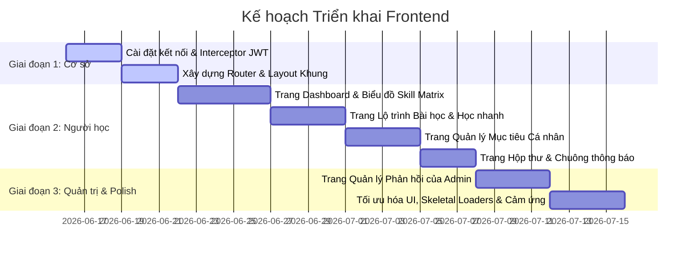

# Tài liệu Thiết kế Hệ thống Frontend: Phân hệ Học tập Thích ứng (Adaptive Learning)

Tài liệu thiết kế này là nguồn dữ liệu chuẩn mực (Single Source of Truth) dành cho đội ngũ phát triển Frontend và các công cụ sinh mã tự động. Tài liệu định nghĩa chi tiết ngôn ngữ thiết kế (Design System), cấu trúc định tuyến (Router), đặc tả kỹ thuật tích hợp API, và lộ trình triển khai theo giai đoạn cho toàn bộ các màn hình của phân hệ Học tập Thích ứng (Adaptive Learning).

---

## 1. Visual Theme & Atmosphere (Chủ đề trực quan & Không gian thiết kế)

Hệ thống hướng tới một giao diện tối giản, hiện đại và đậm chất phân tích dữ liệu kỹ thuật số (Analytical & Premium Slate). Không gian thiết kế tạo cảm giác đáng tin cậy, thông minh và phản hồi tức thì.

*   **Độ mật độ thông tin (Density):** `6/10` (Cân bằng giữa các khoảng trắng thoáng đãng và tính trực quan của dữ liệu).
*   **Độ biến thiên bố cục (Variance):** `8/10` (Sử dụng cấu trúc lưới Bento bất đối xứng, phá vỡ các khối thẻ 3 cột nhàm chán).
*   **Mức độ chuyển động (Motion):** `6/10` (Các hiệu ứng mượt mà sử dụng gia tốc lò xo (Spring Physics), nhấn mạnh vào phản hồi vi mô liên tục của người dùng).

---

## 2. Color Palette & Roles (Bảng màu & Vai trò)

Hệ thống sử dụng dải màu trung tính lạnh (Zinc/Slate) làm nền tảng, kết hợp với một màu nhấn duy nhất có độ bão hòa kiểm soát để điều hướng thị giác. Nghiêm cấm sử dụng các dải màu chuyển sắc Neon hoặc hiệu ứng phát sáng tím/xanh lá dạng AI giá rẻ.

*   **Canvas Dark (Nền chính):** `#0C0D0E` — Nền tối sâu thẳm, giảm mỏi mắt, làm nổi bật dữ liệu trực quan.
*   **Surface Zinc (Bề mặt thẻ/khối):** `#121417` — Bề mặt chứa các thẻ Bento, biểu đồ và form nhập liệu.
*   **Ink White (Chữ chính):** `#F4F4F5` — Màu văn bản chính, có độ tương phản cao trên nền tối.
*   **Steel Muted (Chữ phụ/Mô tả):** `#8E959F` — Màu mô tả phụ, nhãn cấu trúc, thông tin thời gian.
*   **Border Zinc (Đường viền ngăn cách):** `#22252A` — Viền cấu trúc siêu mảnh 1px, tạo ranh giới không gian mà không gây nhiễu thị giác.
*   **Emerald Accent (Màu nhấn phát triển):** `#10B981` — Màu nhấn duy nhất cho các nút hành động chính (Primary CTA), trạng thái hoàn thành (Completed), đường đi tích cực của lộ trình học tập, và vòng tập trung (Focus rings).
*   **Amber Alert (Mảnh cảnh báo trì trệ):** `#F59E0B` — Dùng cho các mục tiêu sắp hết hạn, hoặc nhắc nhở tiến độ học tập.
*   **Crimson Red (Cảnh báo điểm yếu):** `#EF4444` — Biểu thị các kỹ năng yếu dưới 50% trong Skill Matrix hoặc lỗi hệ thống.

---

## 3. Typography Rules (Quy tắc Font chữ & Kiểu chữ)

*   **Phông chữ tiêu đề (Display/Headlines):** Sử dụng font `Satoshi` hoặc `Geist` với kiểu căn lề khít (`letter-spacing: -0.02em`), độ dày trung bình đến cực dày (`font-weight: 500` đến `800`). Cấp bậc độ lớn của tiêu đề được thể hiện qua độ tương phản về màu sắc và độ dày chữ chứ không lạm dụng kích cỡ khổng lồ.
*   **Phông chữ nội dung (Body Text):** Sử dụng font `Geist` hoặc font không chân mặc định cao cấp. Giới hạn tối đa 65 ký tự trên một dòng (`max-width: 65ch`) với giãn dòng thoải mái (`line-height: 1.6`) và sử dụng màu phụ `Steel Muted` cho các khối văn bản dài để tối ưu hóa khả năng đọc.
*   **Phông chữ dữ liệu số (Mono Space):** Sử dụng font `JetBrains Mono` hoặc `Geist Mono` cho toàn bộ các con số phần trăm, điểm thi Quiz, đồng hồ đếm giờ, và mã định danh. Điều này bắt buộc đối với tất cả các màn hình có mật độ thông tin cao.
*   **Điều cấm kỵ (Banned):** Nghiêm cấm sử dụng font `Inter` (quá phổ thông và thiếu cá tính) hoặc các font có chân (Serif) như `Times New Roman` hay `Georgia` trong toàn bộ giao diện dashboard hoặc phần mềm học tập.

---

## 4. Component Stylings (Phong cách của các Component)

*   **Nút nhấn (Buttons):** Thiết kế phẳng dẹt (Flat), không bo viền tròn xoe, không đổ bóng phát sáng (No neon outer glows). Khi được nhấn (`:active`), dịch chuyển cấu trúc nút xuống `-1px` theo trục dọc (`transform: translateY(1px)`) để tạo cảm giác cơ học chân thực. Nút chính sử dụng nền `Emerald Accent` với chữ tối màu, nút phụ sử dụng viền mảnh `Border Zinc` và nền trong suốt.
*   **Thẻ chứa dữ liệu (Cards):** Bo góc vừa phải (`1rem` đến `1.25rem`). Đường viền mảnh `1px` màu `#22252A`. Chỉ sử dụng thẻ khi thực sự cần phân tách cấp bậc thông tin rõ ràng. Trong các bảng dữ liệu mật độ cao, loại bỏ thẻ và thay thế bằng các đường kẻ ngăn cách phía trên (`border-t`) cùng khoảng trống âm (negative space).
*   **Form nhập liệu (Inputs):** Tiêu đề nhãn (Label) luôn nằm cố định phía trên ô nhập liệu, thông tin báo lỗi luôn nằm ngay dưới ô nhập liệu với màu `Crimson Red`. Khi ô nhập được focus, đường viền chuyển sang màu `Emerald Accent` và không có viền bóng mờ bên ngoài.
*   **Trạng thái tải dữ liệu (Loaders):** Sử dụng hiệu ứng quét mờ (Skeletal Shimmer Loaders) khớp chính xác với hình dạng và kích thước của các phần tử UI tương ứng. Tuyệt đối không sử dụng các biểu tượng vòng tròn xoay tròn truyền thống.
*   **Trạng thái trống (Empty States):** Thiết kế các bố cục vector SVG tối giản minh họa trực quan, kèm một thông điệp rõ ràng hướng dẫn học viên thực hiện hành động (ví dụ: "Tạo mục tiêu đầu tiên của bạn") thay vì chỉ hiển thị dòng chữ khô khan "Không có dữ liệu".

---

## 5. Layout Principles (Nguyên tắc Bố cục)

*   **Không chồng lấn (No overlapping):** Mọi phần tử giao diện phải chiếm dụng một không gian độc lập, rõ ràng. Không sử dụng các phần tử có vị trí tuyệt đối (`position: absolute`) đè lên nhau.
*   **Bố cục Bento bất đối xứng (Asymmetric Bento Grid):** Nghiêm cấm thiết kế hàng chứa 3 cột thẻ có kích thước bằng nhau liên tiếp. Hãy kết hợp thẻ dài (2/3 chiều rộng) chứa Lộ trình bài học bên cạnh thẻ ngắn (1/3 chiều rộng) chứa mục tiêu học tập hoạt động.
*   **Cấu trúc lưới Grid thay vì Flexbox phức tạp:** Ưu tiên sử dụng CSS Grid cho bố cục lớn. Không dùng các phép toán `calc()` phần trăm phức tạp để tính toán chiều rộng phần tử.
*   **Thiết kế thích ứng (Responsive):** Toàn bộ giao diện đa cột phải tự động thu gọn về cấu trúc 1 cột duy nhất khi chiều rộng màn hình nhỏ hơn 768px. Khoảng cách giữa các phần lớn tự động co giãn bằng hàm `clamp(2rem, 5vw, 4rem)`.

---

## 6. Motion & Interaction (Chuyển động & Tương tác)

*   **Chuyển động lò xo (Spring Physics):** Mọi chuyển động của giao diện (hover thẻ, mở dropdown, chạy thanh tiến trình) sử dụng thông số lò xo chuẩn: `stiffness: 100` (độ cứng) và `damping: 20` (độ giảm chấn) để tạo cảm giác đầm tay, cao cấp. Không dùng các chuyển động tuyến tính đơn điệu.
*   **Tương tác vi mô tuần hoàn (Perpetual Micro-Interactions):** 
    *   Bài học hiện tại cần hoàn thành trong lộ trình sẽ có một chấm tròn nhỏ nháy sáng xung nhịp chậm (Pulse).
    *   Chuông thông báo sẽ lắc nhẹ khi có thông báo mới chưa đọc.
    *   Thanh tiến độ của mục tiêu (Goals) có hiệu ứng quét sáng nhẹ chạy qua khi người dùng rê chuột vào.
*   **Hiệu ứng hiển thị thác nước (Staggered Cascade Reveal):** Khi tải danh sách thông báo hoặc danh sách bài học, các phần tử không được xuất hiện đồng thời mà hiển thị tuần tự từ trên xuống dưới với độ trễ thác nước cách nhau `50ms`.

---

## 7. Anti-Patterns (Banned - Các mẫu phản thiết kế bị cấm)

*   **KHÔNG** sử dụng biểu tượng cảm xúc (Emojis) trong toàn bộ văn bản UI chính thức.
*   **KHÔNG** sử dụng màu đen tuyệt đối (`#000000`) làm nền — luôn sử dụng màu xám đen đậm Charcoal Ink (`#0C0D0E`).
*   **KHÔNG** dùng các tên giả định nhàm chán như "John Doe", "Acme Corp" trong các ví dụ UI — hãy dùng tên tiếng Việt thực tế.
*   **KHÔNG** sử dụng các từ ngữ sáo rỗng thường thấy của AI trong văn bản tiếng Việt như: "Trải nghiệm liền mạch", "Giải phóng tiềm năng", "Đỉnh cao", "Đột phá". Hãy viết ngắn gọn, trực diện và tập trung vào hành động.
*   **KHÔNG** thêm các nút hoặc ký hiệu chỉ dẫn cuộn trang rác như "Cuộn xuống để khám phá", các mũi tên nhấp nháy ở chân trang Hero.

---

## 8. Cấu trúc Router & Định vị Trang trên Frontend

Hệ thống định tuyến chia làm 2 phân hệ rõ rệt, kết nối trực tiếp đến REST API cổng `5292`.

```mermaid
graph TD
    A[Cổng vào hệ thống] --> B{Đăng nhập JWT}
    B -- Learner Role --> C[/adaptive - Dashboard thích ứng]
    C --> C1[/adaptive/path - Lộ trình bài học đề xuất]
    C --> C2[/goals - Quản lý mục tiêu cá nhân]
    C --> C3[/notifications - Danh sách thông báo]
    B -- Admin Role --> D[/admin/feedback - Quản lý phản hồi học viên]
```

### 8.1 Phân hệ Người học (Learner Pages)
1.  **Trang chủ Thích ứng (`/adaptive`):** Dashboard Bento tập hợp toàn bộ tiến trình học tập, biểu đồ năng lực kỹ năng (Skill Matrix) và gợi ý nhanh.
2.  **Lộ trình Học tập Chi tiết (`/adaptive/path`):** Bản đồ bài học đề xuất theo chặng CEFR hiện tại của học viên.
3.  **Quản lý Mục tiêu Cá nhân (`/goals`):** Màn hình cho phép theo dõi và thiết lập mục tiêu học tập theo hạn chót.
4.  **Hộp thư Thông báo (`/notifications`):** Trang quản lý danh sách thông báo, báo cáo tuần và danh hiệu.

### 8.2 Phân hệ Quản trị viên (Admin Pages)
1.  **Quản lý Phản hồi học viên (`/admin/feedback`):** Trang admin phê duyệt, viết ghi chú và giải quyết các góp ý của học viên về chất lượng bài học thích ứng.

---

## 9. Phân tích Chi tiết Thiết kế Giao diện các Trang & Tích hợp API

### 9.1 Trang Dashboard Thích ứng (`/adaptive`)

*   **Mô tả UI:** Bố cục Bento Grid 2 cột lệch (Trái 60% hiển thị Lộ trình và Mục tiêu hoạt động, Phải 40% hiển thị Biểu đồ Kỹ năng & Lịch sử học).
*   **Các API cần gọi song song:**
    1.  `GET /api/progress/details` (Lấy thông tin tiến trình chi tiết và Skill Matrix).
    2.  `GET /api/learningpaths/current` (Lấy lộ trình các chặng CEFR tổng quát).
    3.  `GET /api/goals/{learnerId}` (Lấy danh sách các mục tiêu hiện tại).
*   **Các thành phần UI chính:**
    *   **Thẻ Tiễn trình Tổng quan (Overview Card):** Hiển thị vòng tròn phần trăm hoàn thành bằng trường `overallCompletionRate` kèm số liệu `lessonsCompleted`/`totalLessons` hiển thị kiểu Mono Font.
    *   **Thẻ Lộ trình Đề xuất nhanh (Personalized Path Widget):** Lấy bài học đầu tiên có trạng thái `InProgress` từ danh sách lộ trình để hiển thị nút "Học ngay" lớn.
    *   **Thẻ Skill Matrix Radar Chart:** Vẽ biểu đồ mạng nhện từ mảng `skillProgress`. Trục biểu đồ là các kỹ năng (`Grammar`, `Vocabulary`, `Reading`, `Listening`, `Pronunciation`), giá trị là `averageScorePercent`.
    *   **Thẻ Phân tích Điểm yếu (Weakness Alert):** Tự động duyệt mảng `skillProgress`. Nếu kỹ năng nào có điểm dưới `50%`, hiển thị một thông báo cảnh báo màu đỏ ở góc dưới biểu đồ kèm theo nhãn: *"Điểm yếu cần chú ý: [Tên kỹ năng]"*.
    *   **Thẻ Lịch sử làm bài (Activity History):** Hiển thị danh sách cuộn mượt các bài kiểm tra gần nhất từ `quizHistory` và bài học gần nhất từ `lessonHistory`.

```markdown
+--------------------------------------------------------+---------------------------------------+
|  [Học tập Thích ứng]  Chào Huy! Trình độ hiện tại: B1   |          SKILL MATRIX (RADAR)         |
|  +--------------------------------------------------+  |                Grammar                |
|  |  BÀI HỌC TIẾP THEO:                              |  |               /       \               |
|  |  "Conditional Sentences Type 1" (Ngữ pháp B1)    |  |     Listening --------- Reading       |
|  |  >> [ Nút: Học ngay ]                            |  |               \       /               |
|  +--------------------------------------------------+  |              Vocabulary               |
|                                                        |                                       |
|  MỤC TIÊU HOẠT ĐỘNG:                                   |  CẢNH BÁO ĐIỂM YẾU:                   |
|  - Hoàn thành 5 bài học Ngữ pháp  [==========> 60%]     |  ⚠️ Kỹ năng "Listening" của bạn đang   |
|  - Đạt điểm trung bình 8.0 Quiz   [====>       35%]     |  dưới 50%. Hãy tập trung luyện thêm!  |
+--------------------------------------------------------+---------------------------------------+
```

---

### 9.2 Trang Lộ trình Học tập Chi tiết (`/adaptive/path`)

*   **Mô tả UI:** Sơ đồ đường đi dạng chuỗi nút dọc (Roadmap Steps Layout) thể hiện dòng chảy của tri thức.
*   **Các API cần gọi:**
    1.  `GET /api/learningpaths/current` (Hiển thị danh sách các chặng CEFR tổng quát từ trình độ hiện tại của học viên đến C2).
    2.  `GET /api/learningpaths/{learnerId}` (Hiển thị chuỗi bài học chi tiết của chặng hiện tại).
*   **Nguyên tắc hiển thị giao diện:**
    *   **Bản đồ chặng CEFR lớn:** Hiển thị dưới dạng một thanh tiến trình nằm ngang ở phía trên cùng của trang. Chặng nào có `status` là `Active` sẽ sáng đèn màu `Emerald Accent` và hiển thị nhãn "(Hiện tại)". Các chặng có trạng thái `Locked` hiển thị màu xám mờ và có icon ổ khóa nhỏ.
    *   **Danh sách bài học chi tiết thuộc chặng hiện tại:** Hiển thị dạng sơ đồ thẻ nối tiếp nhau theo thứ tự tăng dần của trường `sequenceOrder`.
        *   Thẻ bài học có trạng thái `Completed`: Hiển thị icon tích xanh lục, tiêu đề bài học và ngày hoàn thành.
        *   Thẻ bài học có trạng thái `InProgress`: Hiển thị viền nháy sáng xung nhịp chậm (Pulse) màu `Emerald Accent`, kèm nút bấm lớn nổi bật ghi chữ **"Học ngay"**. Nút này khi bấm vào sẽ kích hoạt sự kiện điều hướng người dùng tới trang học chi tiết bài học của Core System bằng trường `lessonId`.
        *   Thẻ bài học có trạng thái `Locked`: Hiển thị biểu tượng khóa, tiêu đề bị làm mờ, người dùng không thể nhấn vào.
    *   **Cơ chế làm tươi (Refetch Strategy):** Khi học viên học xong một bài học hoặc nộp bài Quiz ở Core System (gọi API `POST /api/lessons/{id}/complete` hoặc `POST /api/quizzes/submit`), hệ thống backend sẽ cập nhật trạng thái qua Kafka. Ngay sau khi sự kiện hoàn thành được trả về, frontend cần tự động thực hiện gọi lại (refetch) API `GET /api/learningpaths/{learnerId}` để mở khóa bài học tiếp theo trên giao diện mà không cần người dùng tải lại trang thủ công.

---

### 9.3 Trang Quản lý Mục tiêu Cá nhân (`/goals`)

*   **Mô tả UI:** Bố cục chia đôi màn hình. Bên trái là form thiết lập mục tiêu mới, bên phải là danh sách mục tiêu đang hoạt động hiển thị dưới dạng Bento Grid.
*   **Các API cần gọi:**
    1.  `GET /api/goals/{learnerId}` (Lấy toàn bộ danh sách mục tiêu).
    2.  `POST /api/goals` (Tạo mục tiêu mới).
    3.  `PUT /api/goals/{id}/progress` (Cập nhật tiến trình thủ công đối với một số loại mục tiêu tự do).
*   **Nguyên tắc hiển thị và xử lý biểu mẫu:**
    *   **Form Tạo Mục tiêu mới:** 
        *   Ô nhập mục tiêu cần đạt (`target`): Văn bản giới hạn tối đa 100 ký tự.
        *   Lựa chọn loại mục tiêu (`type`): Trình thả Dropdown hiển thị rõ các loại lựa chọn thân thiện thay vì hiển thị số enum:
            *   *Số lượng bài học hoàn thành* (tương ứng enum `0 = LessonCount`)
            *   *Điểm số bài thi Quiz trung bình* (tương ứng enum `1 = QuizScore`)
            *   *Thời gian học tập tích lũy* (tương ứng enum `2 = StudyTime`)
            *   *Chuỗi ngày học liên tục - Streak* (tương ứng enum `3 = StreakDays`)
            *   *Chứng chỉ kiểm tra thử* (tương ứng enum `4 = CertificateTest`)
        *   Chọn ngày hết hạn (`deadline`): Sử dụng công cụ DatePicker tích hợp đồng bộ màu tối của hệ thống.
    *   **Thành phần hiển thị mục tiêu (GoalProgressBarCard):**
        *   Mỗi thẻ mục tiêu hiển thị tên mục tiêu, nhãn phân loại, thanh tiến trình màu xanh lục chạy theo giá trị phần trăm từ trường `progressPercentage`.
        *   Nếu mục tiêu đã hoàn thành (`isCompleted` là `true`): Hiển thị phù hiệu nổi bật màu xanh lục.
        *   Nếu thời gian hiện tại đã vượt qua trường ngày hết hạn `deadline` mà mục tiêu vẫn chưa hoàn thành (`isCompleted` là `false`): Tô viền thẻ màu đỏ nhạt và hiển thị nhãn màu đỏ cảnh báo: *"Quá hạn chặng đường"*.
        *   Đối với các mục tiêu học tập tự chọn, cung cấp một thanh trượt kéo thả (Slider) cho phép học viên tự tăng giảm tiến độ thực tế và gửi API `PUT /api/goals/{id}/progress` trực tiếp để lưu lại tiến trình.

---

### 9.4 Trang Hộp thư Thông báo (`/notifications`)

*   **Mô tả UI:** Giao diện dạng hộp thư (Inbox Layout) tối giản, sạch sẽ và hiển thị danh sách xếp tầng.
*   **Các API cần gọi:**
    1.  `GET /api/notifications` (Lấy danh sách thông báo).
    2.  `PUT /api/notifications/{id}/read` (Đánh dấu đã đọc một thông báo).
    3.  `POST /api/notifications/read-all` (Đánh dấu đã đọc toàn bộ thông báo).
    4.  `DELETE /api/notifications/clear-all` (Xóa sạch hộp thư thông báo).
*   **Tích hợp UI nâng cao:**
    *   **Biểu tượng Chuông trên Navbar (Notification Bell Dropdown):**
        *   Đếm số lượng thông báo có trường `isRead` bằng `false` để hiển thị chấm đỏ nhỏ hiển thị số lượng chưa đọc.
        *   Khi bấm vào biểu tượng chuông, hiển thị một khung thả xuống nhỏ (Dropdown) hiển thị tối đa 5 thông báo mới nhất. Có liên kết bấm để xem toàn bộ chuyển tới trang `/notifications`.
    *   **Phân loại và hiển thị nội dung đặc thù:**
        *   *Thông báo nhận Huy hiệu (Achievements/Badges):* Khi có thông báo với tiêu đề chứa từ khóa huy hiệu, hiển thị kèm hình ảnh biểu tượng huy hiệu đó (ví dụ: cúp vàng, ngôi sao sáng) nằm bên cạnh tiêu đề thông báo.
        *   *Báo cáo học tập tuần (Weekly Report Summary):* Nội dung tóm tắt báo cáo tuần gửi từ hệ thống chạy ngầm được trình bày trong một thẻ thông báo có kích thước rộng hơn bình thường, cấu trúc thành các gạch đầu dòng gọn gàng (ví dụ: số bài học đã học tuần qua, điểm trung bình đạt được).
    *   **Hành động trên thông báo:** Người dùng bấm vào nút tròn nhỏ bên cạnh mỗi thông báo chưa đọc để gửi API `PUT /api/notifications/{id}/read` ẩn đi chấm đỏ chưa đọc với hiệu ứng mờ dần (fade-out) mượt mà.

---

### 9.5 Trang Quản lý Phản hồi học viên của Admin (`/admin/feedback`)

*   **Mô tả UI:** Giao diện chia đôi dạng bảng điều khiển quản trị (Split-Screen Admin Dashboard). Bên trái là danh sách toàn bộ phản hồi học viên xếp theo bộ lọc trạng thái, bên phải là khung chi tiết và khu vực giải quyết phản hồi.
*   **Các API cần gọi:**
    1.  `GET /api/feedback` (Lấy toàn bộ phản hồi gửi lên hệ thống).
    2.  `POST /api/feedback/{id}/review` (Admin viết ghi chú phân tích).
    3.  `PUT /api/feedback/{id}/resolve` (Đánh dấu đã giải quyết triệt để phản hồi).
*   **Quy tắc phân quyền và xử lý dữ liệu:**
    *   **Kiểm tra Quyền hạn (Role Check):** Khi khởi chạy trang, frontend thực hiện kiểm tra vai trò của người dùng được lưu trữ trong Token JWT hoặc localStorage. Nếu vai trò không phải là `Admin`, lập tức chặn hiển thị nội dung và trả về trang báo lỗi truy cập `403 Forbidden` được thiết kế chỉn chu với nút quay lại trang chủ người học.
    *   **Xử lý Ghi chú Phê duyệt (Review Action):** 
        *   Khi admin chọn một phản hồi cụ thể bên cột trái, cột bên phải hiển thị đầy đủ tên học viên, tiêu đề góp ý, nội dung văn bản và số điểm đánh giá từ học viên (Rating 1-5 sao được vẽ trực quan dạng sao màu xám nhạt).
        *   Cung cấp một ô nhập văn bản lớn (Textarea) ghi nhãn *"Ghi chú của Quản trị viên"*. Admin điền phân tích kỹ thuật vào đây và nhấn nút *"Lưu Ghi chú Phân tích"*. Hành động này gửi API `POST /api/feedback/{id}/review` truyền dữ liệu dạng JSON: `{"feedbackId": id, "adminNotes": "nội dung ghi chú"}`. Sau khi lưu thành công, trạng thái phản hồi chuyển sang đã xem xét.
    *   **Hành động Giải quyết Phản hồi (Resolve Action):** Nút *"Giải quyết Xong"* màu xanh lục chỉ sáng lên sau khi admin đã hoàn thành bước ghi chú phê duyệt ở trên. Nhấn nút này sẽ kích hoạt API `PUT /api/feedback/{id}/resolve`, chuyển trạng thái phản hồi từ chưa giải quyết sang đã hoàn thành, đồng thời cập nhật thời gian giải quyết lên màn hình.

---

### 9.6 Cơ chế Đăng xuất & Thu hồi Phiên đăng nhập (Session & Token Revocation)

*   **Sự kiện đăng xuất:** Khi người dùng nhấn nút *"Đăng xuất"* ở menu góc bên dưới:
    1.  Frontend thực hiện gửi một yêu cầu API `POST /api/auth/logout` đính kèm Token JWT hiện tại trong Header. Yêu cầu này giúp backend ghi token này vào danh sách đen (Blacklist) trong hệ thống bộ nhớ đệm Redis chạy ngầm nhằm vô hiệu hóa token ngay lập tức.
    2.  Không phụ thuộc vào kết quả trả về của API trên, frontend tiến hành xóa sạch toàn bộ khóa liên quan đến thông tin đăng nhập trong bộ nhớ trình duyệt: `localStorage.removeItem('token')`, `localStorage.removeItem('user_level')`, `localStorage.removeItem('user')`.
    3.  Thực hiện điều hướng tức thì người dùng về trang đăng nhập `/login` với hiệu ứng chuyển trang mờ dần (Fade transition).
*   **Bộ lọc chặn lỗi tự động (JWT Interceptor & Error Handler):**
    *   Cấu hình công cụ gọi API (ví dụ Axios Client) có một Interceptor lắng nghe mã phản hồi HTTP từ mọi API.
    *   Nếu bất kỳ API nào trả về lỗi `401 Unauthorized` (biểu thị token đã hết hạn hoặc đã bị đưa vào danh sách đen sau khi đăng xuất trên máy khác):
        *   Frontend tự động kích hoạt tiến trình làm sạch bộ nhớ trình duyệt giống như quy trình đăng xuất ở trên.
        *   Hiển thị một thông báo mờ ngắn (Toast notification): *"Phiên đăng nhập đã hết hạn. Vui lòng đăng nhập lại."* và lập tức redirect về `/login`.

---

## 10. Kế hoạch Triển khai Frontend theo từng Giai đoạn (Phases)

Kế hoạch này phân chia công việc phát triển frontend thành các giai đoạn hợp lý, bám sát tính chất phụ thuộc và độ hoàn thiện của các API nghiệp vụ từ backend.



### Giai đoạn 1: Xây dựng Nền tảng & Xác thực (Hạn định: 6 ngày)
*   **Mục tiêu:** Thiết lập cấu hình hệ thống khung và cấu trúc bảo mật token.
*   **Nội dung công việc:**
    1.  Cài đặt kết nối API Client và cấu hình Interceptor tự động đính kèm token JWT vào Header của mọi request.
    2.  Viết bộ lọc chặn lỗi tự động xóa token và chuyển hướng về `/login` khi nhận mã lỗi `401`.
    3.  Thiết lập các tuyến định tuyến (Router) cơ bản của phân hệ Learner và phân hệ Admin.
    4.  Xây dựng các Layout khung chính (Sidebar tối giản, Navbar tích hợp icon chuông thông báo).

### Giai đoạn 2: Phát triển Phân hệ Người học (Hạn định: 16 ngày)
*   **Mục tiêu:** Triển khai toàn bộ giao diện và tương tác nghiệp vụ phục vụ việc học tập thích ứng của học viên.
*   **Nội dung công việc:**
    1.  **Dashboard & Skill Matrix:** Xây dựng màn hình `/adaptive`, tích hợp biểu đồ Radar bằng SVG hoặc thư viện Chart.js dựa trên dữ liệu `skillProgress`. Triển khai widget cảnh báo điểm yếu.
    2.  **Lộ trình bài học:** Xây dựng trang lộ trình `/adaptive/path`, thiết kế sơ đồ chặng CEFR lớn và chuỗi danh sách bài học dọc. Tích hợp nút "Học ngay" điều hướng sang Core System.
    3.  **Quản lý mục tiêu:** Xây dựng màn hình `/goals`, thiết lập form tạo mục tiêu thích ứng mới và các thẻ tiến độ mục tiêu cho phép tương tác thanh trượt thủ công.
    4.  **Hộp thư thông báo:** Xây dựng trang `/notifications` và dropdown thông báo trên Navbar. Tích hợp tính năng đánh dấu đã đọc riêng biệt và xóa toàn bộ.

### Giai đoạn 3: Phát triển Phân hệ Quản trị & Hoàn thiện UI/UX (Hạn định: 8 ngày)
*   **Mục tiêu:** Triển khai trang dành cho quản trị viên và tiến hành tối ưu hóa trải nghiệm người dùng toàn diện.
*   **Nội dung công việc:**
    1.  **Phân hệ Admin:** Thiết kế trang `/admin/feedback`. Triển khai bộ kiểm tra quyền truy cập (Role checking), giao diện xem danh sách phản hồi, nhập ghi chú đánh giá phản hồi và nút bấm giải quyết vấn đề.
    2.  **Đánh bóng giao diện (Polish):**
        *   Thay thế toàn bộ vòng xoay loading truyền thống bằng Skeletal Shimmer Loaders trên biểu đồ kỹ năng và danh sách bài học.
        *   Tích hợp các hiệu ứng chuyển động vi mô (Pulse chấm tròn bài học, Shake biểu tượng chuông thông báo).
        *   Thực hiện kiểm tra tương thích và căn chỉnh khoảng trống tự động trên các thiết bị di động (Responsive Audit).

---

## 11. Checklist Kỹ thuật dành cho Đội ngũ phát triển Frontend

Trước khi tiến hành viết code cho bất kỳ màn hình nào thuộc phân hệ thích ứng, lập trình viên cần hoàn thành việc tích hợp và kiểm tra kỹ thuật dựa trên bảng kiểm sau:

- [ ] **Kiểm tra Môi trường:** Đã cấu hình chính xác địa chỉ API base URL tại tệp cấu hình `.env` frontend trỏ tới `http://localhost:5292` hoặc địa chỉ máy chủ chạy backend thực tế.
- [ ] **Kiểm tra Xác thực:** Đăng nhập thành công từ Core System và xác nhận Token JWT được lưu chính xác trong bộ nhớ trình duyệt dưới dạng khóa `token`.
- [ ] **Kiểm tra Header:** Thực hiện một yêu cầu thử nghiệm bất kỳ và kiểm tra trên Tab Network của Trình duyệt để đảm bảo Header `Authorization: Bearer <TOKEN>` được đính kèm tự động.
- [ ] **Khả năng Gọi API cơ bản:** Gọi thử nghiệm thành công 3 API cốt lõi thông qua Swagger hoặc ứng dụng khách (GET `/api/progress/details`, GET `/api/learningpaths/current`, GET `/api/notifications`) và nhận về cấu trúc phản hồi chuẩn `success: true`.
- [ ] **Định dạng Lỗi:** Đảm bảo hệ thống xử lý lỗi frontend đọc đúng cấu trúc thông báo lỗi thống nhất dạng `{"success": false, "message": "Nội dung lỗi"}` từ backend để hiển thị chính xác lên giao diện người dùng.
