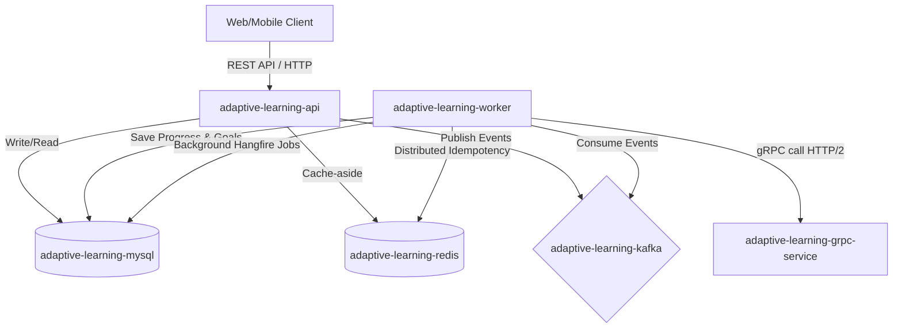
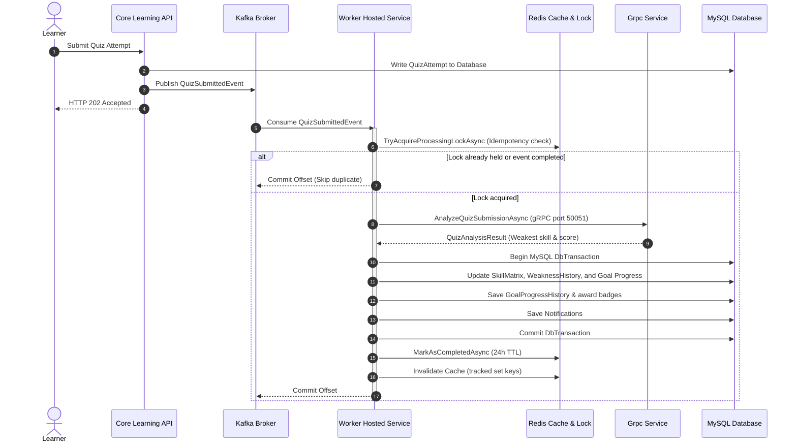

# Technical Architecture Documentation

This document describes the high-level system architecture, service components, communication models, data persistence, and resiliency strategies for the AI-Assisted Adaptive English Learning System.

---

## 1. System Overview & Component Diagram

The following Mermaid diagram outlines the container relationships, service boundaries, and internal dependencies.

---

## 2. Event-Driven Workflow (Kafka & Worker)

When a learner submits quiz attempts or completes lessons, events flow asynchronously as shown below.

---

## 3. Core Component Responsibilities

### 3.1. REST API (`CoreLearningSystem.API`)
- **Owner of Relational Schemas**: Performs EF database migrations (`Database.MigrateAsync()`) and seeds initial configuration data on startup.
- **REST Endpoints**: Serves CRUD requests, manages learner registration/authentication, submits quiz answers, publishes events, and tracks notifications.
- **Cache-Aside Implementation**: Reads lessons lists/details, learner matrices, progress summaries, and active recommendations from Redis first. Queries MySQL on cache miss and populates Redis.

### 3.2. Worker Service (`AdaptiveLearning.Worker`)
- **Event Consumer**: Consumes messages from Kafka (`QuizSubmitted`, `LessonCompleted`, `PlacementTestCompleted`, `GoalCompleted`, etc.).
- **Hangfire Scheduler Host**: Runs background tasks (learning reminders, weekly reports, goal expiration checks, skill decays, and database cleanups).
- **Idempotency Guard**: Ensures transactional processing using Redis-backed distributed event locks.

### 3.3. gRPC Analysis Service (`AdaptiveLearning.GrpcService`)
- **Stateless Analyzer**: Receives raw scores and question metadata via high-speed HTTP/2 and returns calculated weak skills, topics, and metrics.
- **Database-Free**: Does not access MySQL or Redis, keeping gRPC latency low.

---

## 4. Resiliency & Reliability Design

### 4.1. Distributed Idempotency State Machine
- **Processing State**: Atomic `SET NX EX` on `adaptive:v1:processed-event:{eventId}` to `"Processing"` (5m TTL).
- **Success State**: Write `"Completed"` with a long TTL (24h) to prevent re-processing during Kafka consumer restarts/rebalances.
- **Outage Fallback**: If Redis is down, the idempotency store defaults to returning `true` to allow processing, relying on MySQL's unique constraints to block duplicates.

### 4.2. Redis Fallback Policy
- All cache operations are wrapped in `try-catch` blocks.
- If Redis is disconnected, the system logs a `Warning`, bypasses the cache, and routes queries directly to MySQL, guaranteeing 100% API availability.

### 4.3. Kafka Retry & DLQ Strategy
- Event handlers implement bounded retries (3 attempts).
- Transient errors (e.g. database locks, timeouts) trigger delay retries.
- Persistent errors are routed to the Dead Letter Queue (DLQ) topic `dead-letter-topic` to prevent blocking the partition.

### 4.4. Transaction Boundaries & Dual-Write Risk
- Database changes inside event handlers are performed within a single `DbTransaction`.
- **Known Risk**: A crash after committing the DB transaction but before publishing completion events can create inconsistent states (dual-write risk). This is mitigated by idempotent consumer checks on replay.
