# ERD Diagram – AI-Assisted Adaptive English Learning System

## Hướng dẫn dùng:
- Copy Mermaid code bên dưới.
- Vào [Mermaid Live Editor](https://mermaid.live)
- Paste code vào khung soạn thảo.
- Export sang định dạng PNG hoặc SVG.
- Dán ảnh đã xuất vào `project_proposal.docx` tại mục Database Design hoặc phụ lục ERD Diagram.

## Mermaid ERD Code:

```mermaid
erDiagram
    User ||--o| LearnerProfile : "has profile"
    User ||--o{ UserSession : "has sessions"
    User ||--o{ Notification : "receives"

    LearnerProfile ||--o| LearningPath : "has path"
    LearnerProfile ||--o{ PlacementTestResult : "takes placement tests"
    LearnerProfile ||--o{ QuizAttempt : "attempts quizzes"
    LearnerProfile ||--o{ LearnerProgress : "has lesson progress"
    LearnerProfile ||--o{ GoalSetting : "sets goals"
    LearnerProfile ||--o{ LearnerBadge : "earns badges"
    LearnerProfile ||--o{ Feedback : "submits feedbacks"
    LearnerProfile ||--o{ SkillMatrix : "has skills"
    LearnerProfile ||--o{ SkillMatrixHistory : "has skill histories"
    LearnerProfile ||--o{ LearnerWeaknessHistory : "has weakness histories"
    LearnerProfile ||--o{ Recommendation : "gets recommendations"
    LearnerProfile ||--o{ RecommendationHistory : "has recommendation actions"
    LearnerProfile ||--o{ GoalProgressHistory : "has goal histories"
    LearnerProfile ||--o{ WeeklyLearningReport : "receives reports"
    LearnerProfile ||--o{ CertificateTestResult : "takes certificate tests"
    LearnerProfile ||--o{ RecommendationEffectiveness : "tracks effectiveness"

    Quiz ||--o{ Lesson : "associated with"
    Lesson ||--o{ LearningPathItem : "included in path items"
    Lesson ||--o{ LearnerProgress : "has progress entries"
    Lesson ||--o{ Recommendation : "recommended in"
    Lesson ||--o{ RecommendationHistory : "linked to action"
    Lesson ||--o{ RecommendationEffectiveness : "linked to effectiveness"
    Lesson ||--o{ RecommendationStatisticSnapshot : "has snapshots"

    Quiz ||--o{ Question : "contains questions"
    Quiz ||--o{ QuizAttempt : "attempted in"

    Question ||--o{ AnswerOption : "contains options"
    Question ||--o{ QuizAttemptDetail : "answered in details"

    QuizAttempt ||--|{ QuizAttemptDetail : "has details"
    AnswerOption |o--o{ QuizAttemptDetail : "selected in details"

    LearningPath ||--o{ LearningPathItem : "contains items"

    AchievementBadge ||--o{ LearnerBadge : "awarded to"

    GoalSetting ||--o{ GoalProgressHistory : "has history entries"

    Recommendation ||--o{ RecommendationHistory : "has history entries"
    Recommendation ||--o{ RecommendationEffectiveness : "has effectiveness entries"

    Notification ||--o{ NotificationDeliveryAttempt : "has delivery attempts"
    WeeklyLearningReport |o--o| Notification : "associates with notification"

    User {
        int Id PK
        string Username
        string PasswordHash
        UserRole Role
        string Email
        string FullName
        bool IsLocked
        DateTime CreatedAt
        DateTime UpdatedAt
        DateTime LastLoginDate
    }

    LearnerProfile {
        int Id PK
        int UserId FK
        EnglishLevel Level
        ActivityStatus ActivityStatus
        DateTime LastActiveAt
    }

    Lesson {
        int Id PK
        string Title
        string Content
        SkillType Skill
        string Topic
        EnglishLevel Level
        int DurationInMinutes
        LessonStatus Status
        DateTime CreatedAt
        DateTime UpdatedAt
        int QuizId FK
    }

    Quiz {
        int Id PK
        string Title
        string Description
        int DurationMinutes
        double PassingScore
        double MaxScore
        EnglishLevel Level
        bool IsPlacementTest
        DateTime CreatedAt
    }

    Question {
        int Id PK
        int QuizId FK
        string Content
        SkillType Skill
        string Topic
        EnglishLevel Level
        string CorrectAnswer
        string Explanation
        double Score
    }

    AnswerOption {
        int Id PK
        int QuestionId FK
        string OptionText
        bool IsCorrect
    }

    PlacementTestResult {
        int Id PK
        int LearnerProfileId FK
        int Score
        EnglishLevel RecommendedLevel
        DateTime TakenAt
    }

    QuizAttempt {
        int Id PK
        int QuizId FK
        int LearnerProfileId FK
        double Score
        DateTime AttemptedAt
        int DurationSeconds
        bool IsPassed
    }

    QuizAttemptDetail {
        int Id PK
        int QuizAttemptId FK
        int QuestionId FK
        int SelectedAnswerOptionId FK
        bool IsCorrect
    }

    LearningPath {
        int PathId PK
        int LearnerId FK
        DateTime CreatedAt
        LearningPathStatus Status
    }

    LearningPathItem {
        int Id PK
        int LearningPathId FK
        int LessonId FK
        int SequenceOrder
        LessonStatus Status
    }

    LearnerProgress {
        int Id PK
        int LearnerProfileId FK
        int LessonId FK
        bool IsCompleted
        DateTime LastAccessedAt
        DateTime CompletedAt
    }

    GoalSetting {
        int Id PK
        int LearnerProfileId FK
        string Target
        GoalType Type
        double ProgressPercentage
        bool IsCompleted
        DateTime Deadline
        DateTime CreatedAt
        double TargetValue
        double CurrentValue
        string Unit
        string SkillTarget
        string TargetLevel
        DateTime StartDate
        GoalStatus Status
        DateTime CompletedAt
        DateTime UpdatedAt
    }

    AchievementBadge {
        int Id PK
        string Name
        string Description
        string ImageUrl
        string Criteria
        string Code
        AchievementType AchievementType
        double Threshold
        string SkillTarget
        bool IsActive
        DateTime UpdatedAt
    }

    LearnerBadge {
        int Id PK
        int LearnerProfileId FK
        int BadgeId FK
        DateTime UnlockedAt
        string SourceEventId
        double ProgressValue
        string Reason
    }

    GoalProgressHistory {
        int Id PK
        int GoalId FK
        int LearnerProfileId FK
        string SourceEventId
        double PreviousValue
        double AddedValue
        double NewValue
        GoalStatus StatusBefore
        GoalStatus StatusAfter
        string Reason
        DateTime RecordedAt
    }

    Feedback {
        int Id PK
        int LearnerProfileId FK
        string Subject
        string Content
        int Rating
        FeedbackTargetType TargetType
        int TargetId
        FeedbackStatus Status
        DateTime CreatedAt
        DateTime UpdatedAt
        DateTime ProcessedAt
        string AdminResponse
        int ReviewedByAdminId
        string ReviewComment
        DateTime ReviewedAt
    }

    FeedbackAnalysis {
        int Id PK
        string AggregateKey
        FeedbackTargetType TargetType
        int TargetId
        int FeedbackCount
        double AverageRating
        int PositiveCount
        int NeutralCount
        int NegativeCount
        int LowRatingCount
        DateTime LastFeedbackAt
        DateTime LastAnalyzedAt
        FeedbackAlertStatus AlertStatus
        DateTime AlertedAt
        DateTime UpdatedAt
    }

    Notification {
        int Id PK
        int UserId FK
        string Title
        string Message
        bool IsRead
        DateTime CreatedAt
        NotificationType Type
        NotificationStatus Status
        NotificationChannel Channel
        string IdempotencyKey
        string SourceType
        string SourceId
        string SourceEventId
        DateTime ScheduledAt
        DateTime SentAt
        DateTime ReadAt
        DateTime FailedAt
        int RetryCount
        string LastError
        DateTime UpdatedAt
    }

    NotificationDeliveryAttempt {
        int Id PK
        int NotificationId FK
        NotificationChannel Channel
        int AttemptNumber
        NotificationStatus Status
        string ErrorMessage
        DateTime AttemptedAt
        DateTime CompletedAt
    }

    SkillMatrix {
        int Id PK
        int LearnerProfileId FK
        SkillType Skill
        double CurrentScore
        MasteryLevel MasteryLevel
        int TotalAssessments
        double LastAssessmentScore
        DateTime LastUpdatedAt
        DateTime CreatedAt
    }

    SkillMatrixHistory {
        int Id PK
        int SkillMatrixId FK
        int LearnerProfileId FK
        SkillType Skill
        double PreviousScore
        double AssessmentScore
        double NewScore
        MatrixSourceType SourceType
        int SourceId
        Guid EventId
        string Reason
        string DecayPeriodKey
        DateTime RecordedAt
    }

    LearnerWeaknessHistory {
        int Id PK
        int LearnerProfileId FK
        SkillType Skill
        string Topic
        string Level
        int IncorrectCount
        int OccurrenceCount
        DateTime LastOccurredAt
        DateTime FirstOccurredAt
        int SourceQuizAttemptId
        Guid LastEventId
        WeaknessStatus Status
    }

    Recommendation {
        int Id PK
        int LearnerProfileId FK
        int LessonId FK
        SkillType Skill
        string Topic
        EnglishLevel Level
        double PriorityScore
        string Reason
        RecommendationStatus Status
        string SourceEventId
        DateTime GeneratedAt
        DateTime ExpiresAt
        DateTime AcceptedAt
        DateTime CompletedAt
        DateTime DismissedAt
        DateTime CreatedAt
        DateTime UpdatedAt
    }

    RecommendationEffectiveness {
        int Id PK
        int RecommendationId FK
        int LearnerProfileId FK
        int LessonId FK
        string Skill
        string Topic
        double ScoreBefore
        double ScoreAfter
        double Improvement
        bool WasEffective
        DateTime EvaluatedAt
        int SourceQuizAttemptId
        DateTime CreatedAt
    }

    RecommendationHistory {
        int Id PK
        int RecommendationId FK
        int LearnerProfileId FK
        int LessonId FK
        string SourceEventId
        RecommendationAction Action
        RecommendationStatus PreviousStatus
        RecommendationStatus NewStatus
        string Reason
        DateTime RecordedAt
    }

    RecommendationStatisticSnapshot {
        int Id PK
        DateTime PeriodStart
        DateTime PeriodEnd
        int LessonId FK
        string Skill
        string Topic
        int RecommendationCount
        int CompletionCount
        int EffectiveCount
        double EffectivenessRate
        double AverageImprovement
        DateTime GeneratedAt
    }

    WeeklyLearningReport {
        int Id PK
        int LearnerProfileId FK
        DateTime WeekStart
        DateTime WeekEnd
        int LessonsCompleted
        int QuizzesCompleted
        double AverageScore
        string StrongestSkill
        string WeakestSkill
        string GoalProgressSummary
        string BadgesEarned
        int RecommendationsCompleted
        int StreakDays
        DateTime GeneratedAt
        int NotificationId FK
    }

    BackgroundJobExecution {
        int Id PK
        string JobName
        string ExecutionId
        DateTime StartedAt
        DateTime CompletedAt
        JobStatus Status
        int ProcessedCount
        int SuccessCount
        int FailedCount
        int SkippedCount
        string ErrorMessage
        double DurationMilliseconds
        string TriggerType
        DateTime CreatedAt
    }

    CertificateTestResult {
        int Id PK
        int LearnerProfileId FK
        CertificateType CertificateType
        double Score
        double MaxScore
        double TargetScore
        bool Passed
        DateTime TakenAt
        int SourceQuizAttemptId
        DateTime CreatedAt
    }

    UserSession {
        int Id PK
        int UserId FK
        string SessionTokenHash
        string RefreshTokenHash
        string JwtId
        DateTime CreatedAt
        DateTime ExpiresAt
        DateTime RevokedAt
        DateTime LastSeenAt
        string IpAddress
        string UserAgent
        SessionStatus Status
    }

    OutboxMessage {
        int Id PK
        string EventId
        string AggregateType
        string AggregateId
        string EventType
        string Topic
        string Payload
        string HeadersJson
        OutboxStatus Status
        DateTime OccurredAt
        DateTime ProcessedAt
        int RetryCount
        string LastError
        DateTime CreatedAt
    }
```

