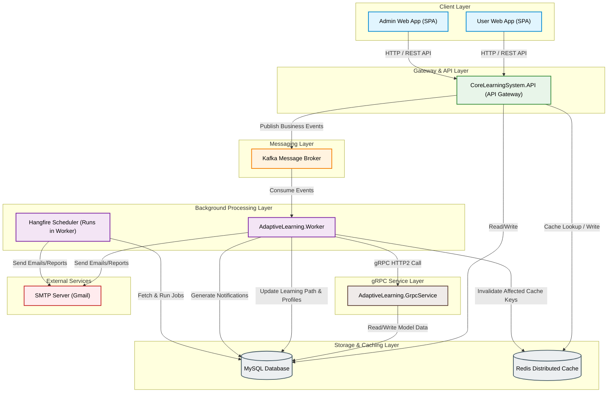
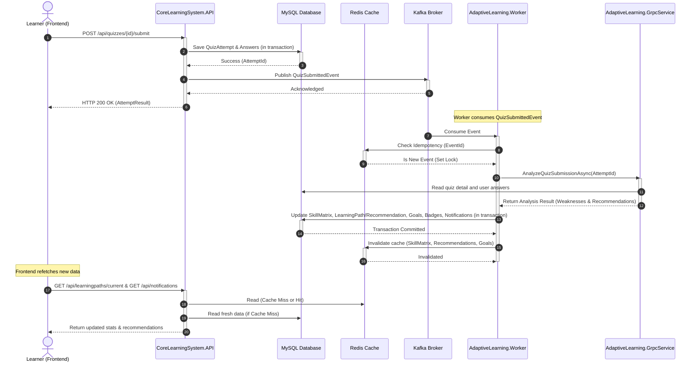
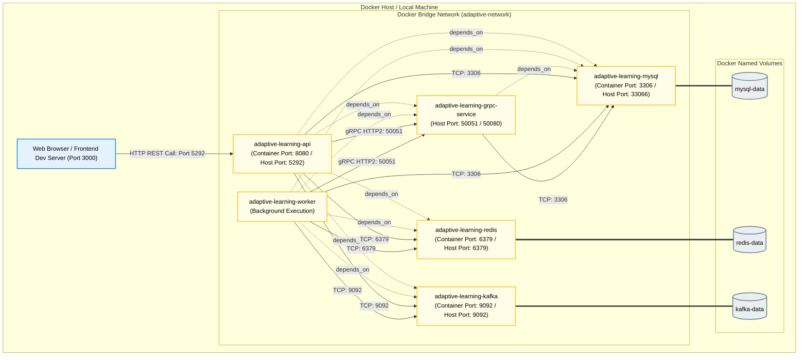

# Mermaid Diagrams – AI-Assisted Adaptive English Learning System (Architecture, Sequence, Deployment)

Tài liệu này chứa các biểu đồ Mermaid trực quan phục vụ cho mục **11. Architecture Diagram** trong tài liệu `project_proposal.docx`.

---

## 1. Hướng dẫn dùng:
- **Bước 1**: Copy toàn bộ nội dung của một block mã Mermaid (nằm trong khối ```mermaid ... ```).
- **Bước 2**: Truy cập vào trang web [Mermaid Live Editor](https://mermaid.live).
- **Bước 3**: Dán đoạn mã vừa copy vào khung soạn thảo bên trái (khu vực "Code").
- **Bước 4**: Kiểm tra hình ảnh xem trước hiển thị ở khung bên phải. Chọn nút **Actions** -> **Export** -> tải về định dạng **SVG** (để chèn vào Word sắc nét, không bị vỡ hạt) hoặc **PNG**.
- **Bước 5**: Chèn ảnh đã tải về vào mục **11. Architecture Diagram** trong file `project_proposal.docx`.

---

## 2. System Architecture Diagram
Biểu đồ mô tả kiến trúc tổng quan hệ thống từ Client đến Gateway API, các dịch vụ xử lý nền, gRPC service và các cơ sở dữ liệu/caching/messaging.



---

## 3. Event Flow / Sequence Diagram (Luồng Quiz Submit)
Biểu đồ tuần tự (Sequence Diagram) mô tả chi tiết luồng xử lý bất đồng bộ dựa trên sự kiện khi học viên hoàn thành một bài kiểm tra ngắn (Quiz).



---

## 4. Deployment Diagram
Biểu đồ triển khai mô tả cấu trúc mạng Docker Compose, các container dịch vụ, cổng kết nối (Port) ra ngoài và liên kết phân chia cơ sở dữ liệu thông qua volumes.


